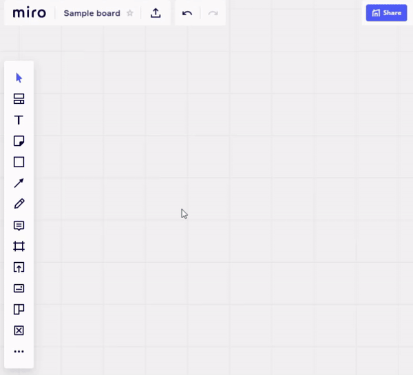

# Plugin for Miro - Tic Tac Toe game

This plugin allows to play Tic Tac Toe game on Miro board.

## Installation
[CLICK HERE](https://miro.com/oauth/authorize/?response_type=token&client_id=3074457347056197788&redirect_uri=https://kaszaq.github.io/miro-tic-tac-toe/installComplete.html) to install plugin in Miro.

## Why

Sometimes you are tired of asking "how are you" when you are waiting for others to join your remote meeting. Now you have an alternative - play Tic Tac Toe Game! :)

## Use case

* When you are first at the meeting and waiting for others - why not play a short game with someone who is already there?
* Every system has to have a Tic Tac Toe game!

## Known issues & upcoming features
* The icons could be a bit more wide to fit better with Miro UX
* In Miro when text is removed it is not actually updated on the Miro board this is visible only after reload. Hence when you are trying to clear the text you need to change the color of the text to fit with the background.

## License

Licensed under the Apache License, Version 2.0 (the "License");
you may not use this file except in compliance with the License.
You may obtain a copy of the License at

    http://www.apache.org/licenses/LICENSE-2.0

Unless required by applicable law or agreed to in writing, software
distributed under the License is distributed on an "AS IS" BASIS,
WITHOUT WARRANTIES OR CONDITIONS OF ANY KIND, either express or implied.
See the License for the specific language governing permissions and
limitations under the License.
